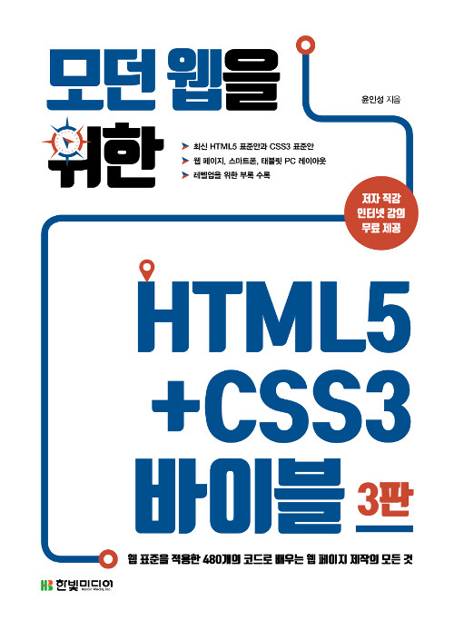

# 모던 웹을 위한 HTML5+CSS3 바이블

`HTML5` `CSS3`

## 개요

이 저장소는 **모던 웹을 위한 HTML5+CSS3 바이블**의 학습 내용이 정리되어 있습니다.

> 윤인성

## 학습 목표
- HTML5, CSS3 미숙한 부분 검토

## 학습 내용
|No|목차|핵심 학습 내용|
|---|---|:---:|
|01|HTML5 개요|요약 내용 없음|
|02|[HTML5 태그 기본](https://github.com/hwahyeon/HTML5CSS3/blob/main/ch.02.html)|○|
|03|[CSS3 선택자 기본](https://github.com/hwahyeon/HTML5CSS3/tree/main/ch.03)|○|
|04|[CSS3 스타일 속성 기본](https://github.com/hwahyeon/HTML5CSS3/tree/main/ch.04)|○|
|05|[웹 페이지 레이아웃](https://github.com/hwahyeon/HTML5CSS3/blob/main/ch.05.html)|○|
|06|스마트폰 레이아웃||
|07|||
|08|||
|09|||
|10|||
|11|||
|12|||
|Appendix|||

## 참고자료
[공개 코드](https://hanbit.co.kr/support/supplement_survey.html?pcode=B8371709349)
